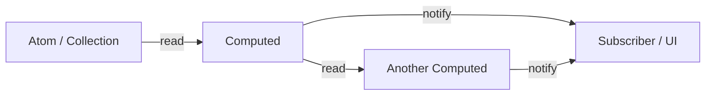

# AI Documentation: @supercat1337/store

**Lightweight reactive state manager for modern JavaScript**  
~13 KB bundled, zero external dependencies, automatic dependency tracking, cycle protection, and first‑class TypeScript support via JSDoc.

---

## Table of Contents

1. [Core Concepts & Architecture](#core-concepts--architecture)
2. [Class: `Store`](#class-store)
3. [Class: `Atom<T>`](#class-atomt)
4. [Class: `Collection<T>`](#class-collectiont)
5. [Class: `Computed<T>`](#class-computedt)
6. [Class: `UpdateEventDetails<T>`](#class-updateeventdetailst)
7. [Type Aliases & Interfaces](#type-aliases--interfaces)
8. [Advanced Features](#advanced-features)
9. [Best Practices](#best-practices)
10. [Comparison with Signals](#comparison-with-signals)
11. [Installation & Import](#installation--import)
12. [TypeScript Configuration](#typescript-configuration)

---

## Core Concepts & Architecture

The store is built around a **directed acyclic graph (DAG)** of reactive nodes. Changes flow in one direction:



- **Atom** – holds a primitive or object value.
- **Collection** – reactive array with granular updates.
- **Computed** – lazily evaluated derived value, automatically tracks dependencies.
- **Store** – central registry, manages version counters and propagation.

**Cycle protection** – before registering a computed, the store performs a static check. If a cycle is detected (`A → B → A`), an error is thrown immediately.

---

## Class: `Store`

### Creating a Store

```ts
const store = new Store();
```

### Working with Items

| Method                                                  | Description                              |
| ------------------------------------------------------- | ---------------------------------------- |
| `setItem(name: string, value: any): void`               | Create or update an atom.                |
| `getItem(name: string): any`                            | Read value (tracks in computed context). |
| `hasItem(name: string): boolean`                        | Check existence.                         |
| `deleteItem(name: string): boolean`                     | Remove item and subscribers.             |
| `getItems(showComputed?: boolean): Record<string, any>` | Get all atoms (optionally computeds).    |
| `reset(): void`                                         | Clear all items and subscribers.         |
| `seal()` / `unseal()` / `isSealed(): boolean`           | Prevent item creation/deletion.          |

### Creating Reactive Primitives

| Method                                                                                     | Returns    | Correct signature   |
| ------------------------------------------------------------------------------------------ | ---------- | ------------------- |
| `createAtom(value: T, name?: string): Atom<T>`                                             | Atom       | ✅ `value` first    |
| `createCollection(array: T[], name?: string): Collection<T>`                               | Collection | ✅ `array` first    |
| `createComputed(callback: () => T, name?: string, options?: ComputedOptions): Computed<T>` | Computed   | ✅ `callback` first |

**Example:**

```ts
const price = store.createAtom(10, 'price');
const items = store.createCollection([], 'basket');
const total = store.createComputed(() => price.value * items.value.length);
```

### Subscriptions & Events

- **`subscribe(itemName, callback, debounceMs?)`** – low‑level per‑item subscription.
- **`onChange(callback)`** – global change event.
- **`onChangeAny(items[], callback)`** – scoped change event.
- **`when(predicate, effect?)`** – waits for predicate to become true.
- **`autorun(func, options?)`** – runs immediately and on every dependency change.
- **`reaction(dataFn, effectFn, options?)`** – runs effect only when dataFn output changes.

```ts
store.subscribe('counter', details => console.log(details.value), 100);
store.when(
    () => store.getItem('counter') >= 10,
    () => console.log('Reached 10!')
);
store.autorun(() => console.log('Count:', store.getItem('counter')));
```

### Advanced Methods

- **`asObject(): Record<string, any>`** – reactive proxy for direct property access.
- **`observeObject<T>(obj: T): T & { store: Store }`** – turns a plain object reactive.
- **`recalcComputed(name: string)`** – force recompute.
- **`getUsedItems(func): { value, items }`** – low‑level dependency tracking.
- **`setCompareFunction(name, funcOrNull)`** – custom equality.
- **`next(callback)`** – defer after current reaction batch.

---

## Class: `Atom<T>`

```ts
const count = store.createAtom(0, 'count');

count.value = 5; // setter triggers reactivity
console.log(count.value); // 5

count.subscribe(details => {
    console.log(`changed from ${details.old_value} to ${details.value}`);
});
```

### API

- `value` (get/set)
- `name` (readonly)
- `store` (readonly)
- `subscribe(callback, debounceMs?)`
- `clearSubscribers()`, `hasSubscribers()`
- `onHasSubscribers(callback)`, `onNoSubscribers(callback)`
- `setCompareFunction(funcOrNull)`

---

## Class: `Collection<T>`

Wraps an array. Mutations like `push`, `pop`, `splice`, index assignment trigger reactivity.

```ts
const todos = store.createCollection([], 'todos');
todos.value.push('Learn reactivity');
todos.updateItemValue(0, { text: 'Learn reactivity', done: true });
```

### API

- `value` / `content` – get/set entire array.
- `updateItemValue(index, updateData)` – immutable update of one item.
- `subscribe(callback, debounceMs?)` – `details.property` is `"length"` or an index string.
- All standard subscription management methods.

---

## Class: `Computed<T>`

Lazy, cached derived value. Re‑evaluates only when stale.

```ts
const a = store.createAtom(2);
const b = store.createAtom(3);
const sum = store.createComputed(() => a.value + b.value);

console.log(sum.value); // 5
a.value = 10; // sum becomes stale but not recalculated until accessed
console.log(sum.value); // 13 (recalc happens now)
```

### API

- `value` (readonly)
- `recalc()` – force recalc.
- `subscribe(...)` – like `Atom`.
- `setCompareFunction(...)`

### `is_hard` option

When `{ is_hard: true }`, the computed also compares deep equality of the result before marking itself as changed. Useful for expensive calculations that often return the same value.

---

## Class: `UpdateEventDetails<T>`

Payload passed to every subscriber.

```ts
{
    value: T; // current value
    old_value: T; // previous value
    item_name: string; // reactive item name
    eventType: 'set' | 'delete';
    property: string | null; // for collections: index or "length"
}
```

---

## Type Aliases & Interfaces

```ts
type Unsubscriber = () => void;
type Subscriber = (details: UpdateEventDetails<any>, store: Store) => void;
type CompareFunction = (a: any, b: any, item_name: string, property: string | null) => boolean;
type ComputedOptions = { is_hard?: boolean };
type ChangeEventObject = Record<string, UpdateEventDetails<any>[]>;
type ChangeEventSubscriber = (data: ChangeEventObject, store: Store) => void;
interface TypeStructureOfComputed {
    /* ... */
}
```

---

## Advanced Features

### Debouncing

```ts
store.subscribe('input', handler, 300); // per subscription
store.setDebounceTime(100); // global default
```

### Custom Compare Function

```ts
store.setCompareFunction('user', (old, new) => old.id === new.id);
```

### Cycle Detection

If a computed creates a cycle, an error is thrown **at creation time**:

```ts
// A depends on B, B depends on A – will throw
```

### Store Sealing

```ts
store.seal();
store.createAtom(42, 'new'); // error – cannot add new items
```

---

## Best Practices

| Use `Atom` when…                                        | Use `Collection` when…                                   | Use `Computed` when…                    |
| ------------------------------------------------------- | -------------------------------------------------------- | --------------------------------------- |
| Primitive values (number, string, boolean)              | Arrays that will be mutated (push, pop, splice)          | Deriving data from existing state       |
| Configuration objects that are replaced as a whole      | Lists of items (todos, products, messages)               | Formatting, filtering, aggregating      |
| Single values used in several computeds                 | Working with indices or updating objects inside an array | Avoiding manual subscription management |
| **Do not** put large arrays in an Atom (use Collection) | –                                                        | –                                       |

### When to use `autorun` vs `reaction`

- `autorun` – side effects that should run on **any** accessed reactive value.
- `reaction` – side effects that should run only when **specific derived data** changes (more efficient).

### Memory management

Always call `unsubscribe()` when a component unmounts or you no longer need updates. Use `onHasSubscribers` / `onNoSubscribers` for lazy resource initialisation.

---

## Comparison with Signals

| Feature                 | `@supercat1337/store`                                          | Preact/Vue Signals                |
| ----------------------- | -------------------------------------------------------------- | --------------------------------- |
| **Primitive**           | `Atom`                                                         | `signal()`                        |
| **Derived**             | `Computed`                                                     | `computed()`                      |
| **Effect**              | `autorun`, `reaction`                                          | `effect()`                        |
| **Arrays**              | `Collection` (specialised)                                     | `signal([])` (manual tracking)    |
| **Dependency tracking** | Automatic during execution                                     | Automatic                         |
| **Cycle detection**     | Static, prevents loops                                         | Runtime, may cause stack overflow |
| **Lazy evaluation**     | Yes (Computed only)                                            | Yes                               |
| **Batch updates**       | Automatic via `setItems`                                       | Usually manual                    |
| **TypeScript**          | JSDoc + `.d.ts`                                                | Built‑in                          |
| **Bundle size**         | ~13 KB                                                         | ~2–4 KB (core only)               |
| **Extra features**      | `when`, `observeObject`, `updateItemValue`, `onHasSubscribers` | –                                 |

**Key differentiator of `@supercat1337/store`**: built‑in **cycle detection** and **`Collection`** with granular mutation helpers, plus a smaller API surface that is easy to reason about.

---

## Installation & Import

```bash
npm install @supercat1337/store
```

```ts
import { Store } from '@supercat1337/store';
```

### CDN / ESM bundle

```html
<script type="importmap">
    {
        "imports": {
            "@supercat1337/store": "https://cdn.jsdelivr.net/npm/@supercat1337/store@latest/dist/store.bundle.esm.js"
        }
    }
</script>
<script type="module">
    import { Store } from '@supercat1337/store';
    const store = new Store();
</script>
```

---

## TypeScript Configuration

For local development (inside the repository) add to `jsconfig.json` / `tsconfig.json`:

```json
{
    "compilerOptions": {
        "allowJs": true,
        "checkJs": true,
        "moduleResolution": "node",
        "paths": {
            "@supercat1337/store": ["./src/index.js"]
        }
    },
    "include": ["src/**/*", "examples/**/*"]
}
```

The published package includes `types.d.ts` – no extra configuration needed.

---

## License

MIT – Albert Bazaleev

```

```
